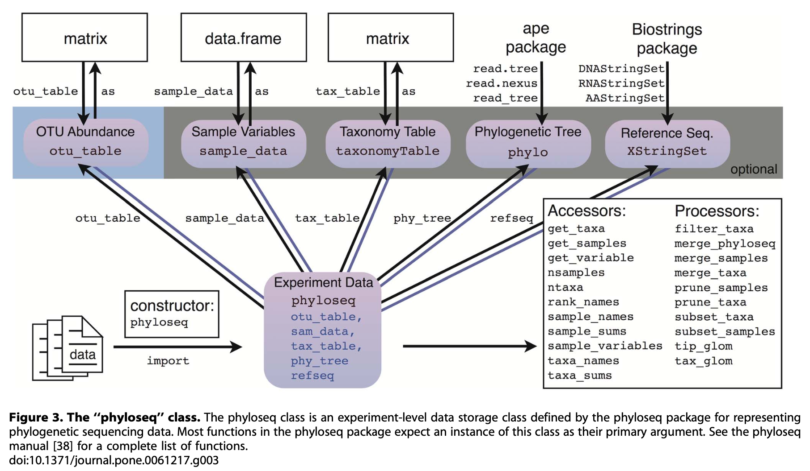

```{r setup, include=FALSE}
knitr::opts_chunk$set(echo = TRUE, 
                      fig.align = "center", 
                      # write figures to the figures folder
                      fig.path = "../figures/03_PreProcessing/")
```


# Goals 

First, we will use the [phyloseq package](https://joey711.github.io/phyloseq/) to combine all of our data objects that we exported from the DADA2 workflow (`asv_table`, `tax_table`, and metadata) and incorporate them into a single [specialized S4 R Data object](https://adv-r.hadley.nz/s4.html), known as a phyloseq object. Then, we will remove any potential contaminants and evaluate the accuracy of our sequencing run. Finally, we will write our our single `raw_preprocessed_physeq` phyloseq data object. 

## Specific Steps: 

1. Load in data that we've generated in `analysis/02_AssignASVs.Rmd` and fix all of the names to match each other. *The names must match for us to incorporate them into the S4 phyloseq object*: 
    a. `asv_table`: ASVs (rows) x Samples (columns)
    b. `tax_table`: ASV (rows) x Taxonomy (columns)
    c. `metadata`: Samples (rows) x All our data (*e.g. pH, Temp, treatment group, etc*; columns)
2. Combine the data into a phyloseq object. 
3. Remove any contaminating ASVs that are **chloroplasts**. 
4. Remove ASVs that are **mitochondria**. 
5. Evaluate any ASVs from the **negative controls**. Then, remove negative controls. 
6. Evaluate the mock community or **positive control** to learn the accuracy of sequencing. 
7. Check for **reverse complements**. 
8. Check the **sequencing depth** of samples. Remove samples that obviously have too few reads. 
9. Write a `raw_preprocessed_physeq` to be used in the next step of our workflow. 

## Input 

1. **Metadata**: `metadata.csv` and `data/01_DADA2/track_read_counts.RData`.
2. **ASV table**: `data/01_DADA2/ASV_table.csv` 
3. **Taxonomy Table**: `data/01_DADA2/ASV_taxonomy.tsv`

## Output 

1. A **pre-processed S4 phyloseq object**: `raw_preprocessed_physeq.RData`.

# What is a phyloseq object? 

Below is figure 3 from the phyloseq paper by [McMurdie et al. (2013) in PLoS ONE](http://journals.plos.org/plosone/article?id=10.1371/journal.pone.0061217). 

Phyloseq 



## Why use phyloseq? 

It's about making our job as microbial ecologists easier! Phyloseq helps us as researchers to: 

- Efficiently integrates multiple data types in (microbiome/sequencing) research.
- Supports biodiversity analyses (alpha, beta diversity) and statistical tests, which we are working towards. 
- Access built-in functions for filtering (`prune_taxa()`, `prune_samples()`), subsetting (`subset_taxa()`, `subset_samples()`), and normalizing data across a database.
- Enables easy visualization with functions like `plot_richness()`, `ordinate()`, and `plot_ordination()`.

# Set Environment 

## Load Packages 
```{r load-packages}
#install.packages("BiocManager")
#BiocManager::install("Biostrings")

# Load packages with pacman
# Be sure that you load dada2 & Patchwork, which we didn't do in class on March 12th
pacman::p_load(devtools, phyloseq, dada2, patchwork, 
               Biostrings, tidyverse, install = FALSE)
```

## Timing of this script

Let's record how long this file took to run on the class server, which we will record at the end of the script. 

```{r rmd-start}
# What time did we start running this script? 
start_time <- Sys.time()
```


## 1. Load Data 

### 1a. Metadata 

Here, we will load in our **metadata** files, which include: 

1. `data/metadata.csv`: This file contains all of our samples and also any measured variables, including station, date of collection, depth of sample, temperature, pH, salinity, etc. 
2. `data/01_DADA2/track_read_counts.RData`: This file contains how many reads we maintained in our samples through the DADA2 workflow. 

```{r load-metadata}
# load in metadata
metadata_df <- 
  read_csv("data/metadata.csv") %>%
  # Fix Column Name
  dplyr::rename("sample_names" = "...1") %>%
  # Add sample names also as a column 
  mutate(names = sample_names) 

# Inspect 
head(metadata_df)
dim(metadata_df)

# include dada2 output
load("data/01_DADA2/track_read_counts.RData")

# Take a look
glimpse(track_counts_df)
dim(track_counts_df)

# Check filenames 
head(track_counts_df$sample_names)

# Fix sample names in track_reads 
track_counts_df$sample_names <- sapply(strsplit(track_counts_df$sample_names, "_"), `[`, 1)

# Intuition check 
head(track_counts_df$sample_names)

# What's different? 
setdiff(track_counts_df$sample_names, metadata_df$sample_names)

# Let's do a filtering join with left_join 
metadata_final_df <- 
  metadata_df %>%
  left_join(., track_counts_df, by = "sample_names") %>%
  # sample names to the rownames to merge into phyloseq
  column_to_rownames(var = "sample_names")

# Check 
dim(metadata_final_df)
```

### 1b. ASV Table 

Now, let's load in the ASV count table. 

```{r load-asv-table}
asv_df <- 
  read.delim(file = "data/01_DADA2/ASV_table.tsv", sep = "\t",
           # add the column names and row names 
           header = TRUE, row.names = 1) %>%
  dplyr::select(-"CJ.V08.P") 

# Inspect 
asv_df[1:3, 1:3]

# fix Column names 
## Remove the X: denote at the beginning "^"
colnames(asv_df) <- sub(pattern = "^X", replacement = "" , colnames(asv_df))
## Replace the . with a -: "\\." since . is a special character in regex
colnames(asv_df) <- gsub(pattern = "\\.", replacement = "-", colnames(asv_df))

# Final inspection 
head(colnames(asv_df))
asv_df[1:3, 1:3]
```

### 1c. Taxonomy Table

```{r load-tax-table}
tax_df <- 
  read.delim("data/01_DADA2/ASV_taxonomy.tsv", sep = "\t",
           header = TRUE, row.names = 1) 

# Inspect
dim(tax_df)
dim(asv_df)

# Add check 
stopifnot(rownames(asv_df) == rownames(tax_df))
```

# 2. Handoff to phyloseq 
```{r phyloseq-handoff}
raw_physeq <- 
  phyloseq(otu_table(asv_df, taxa_are_rows = TRUE),
         sample_data(metadata_final_df),
         tax_table(as.matrix(tax_df)))

# Check out 
raw_physeq

# save 
save(raw_physeq, file = "data/03_PreProcessing/raw_physeq.RData")
```

# Clean up the data! 


## 3. Remove chloroplasts

```{r rm-chloro}
noChloros_physeq <- 
  raw_physeq %>%
  subset_taxa(Order != "Chloroplast" | is.na(Order))

# How many ASVs were chloroplasts? 
numChloros_ASVs <- ntaxa(raw_physeq) - ntaxa(noChloros_physeq)

#There were `r numChloros_ASVs` ASVs that were chloroplasts.
```


## 4. Remove Mitochondria 

```{r rm-mitos}
noChlorosMitos_physeq <-  
  noChloros_physeq %>%
  subset_taxa(Family != "Mitochondria" | is.na(Family)) 

# How many ASVs were mitochondria? 
numMitos_ASVs <- ntaxa(noChloros_physeq) - ntaxa(noChlorosMitos_physeq)

#There were `r numMitos_ASVs` ASVs that were mitochondria in the data set.
```


# Evaluate and remove the control samples 

Now, let's take a look at the negative controls and then make a decision about whether or not to remove the ASVs that we found in our controls 

1. Negative controls 
2. ASVs found within the negative controls and their distribution in the samples. 
3. Evaluate the mock community 


## 5. Negative Controls 

```{r neg-controls}
# Make a phyloseq object with only the negative controls 
neg_control_samples <- c("WaterControl", "022um-Control", 
                         "3um-Control", "DNA-Ext-Control")

# Create a phyloseq object with only negative controls 
neg_control_physeq <- 
  noChlorosMitos_physeq %>%
  subset_samples(., names %in% neg_control_samples) %>%
  # rm ASVs with 0 counts 
  prune_taxa(taxa_sums(.) > 0, .)

# Take a look at the ASV abundances in our negative controls 
neg_control_physeq %>%
  plot_bar(., "ASV", fill = "ASV")

# What's the abundance of these neg control ASVs in real samples? 
# create vector of ASVs 
neg_controlASVs_vec <- 
  neg_control_physeq %>%
  tax_table() %>%
  data.frame() %>%
  dplyr::select(ASV) %>%
  as.vector()
  
# use vector to subset from larger dataset, creating a new phyloseq object 
neg_controlASV_physeq <- 
  noChlorosMitos_physeq %>%
  subset_taxa(., ASV %in% neg_controlASVs_vec$ASV)

# Take look 
neg_controlASV_physeq

# Plot Abundances of neg control ASVs in samples versus controls 
neg_controlASV_physeq %>%
  plot_bar(., "ASV", facet_grid = Sample_or_Control~.)

# Create a new vector with all ASVs except ASV_0017, ASV_0050
negControlASVs_rm <- dplyr::setdiff(neg_controlASVs_vec$ASV, c("ASV_0017", "ASV_0050"))

# Make new phyloseq object with negControl ASVs removed 
noChlorosMitosNegControls_physeq <- 
  noChlorosMitos_physeq %>%
  # rm ASVs
  subset_taxa(., !(ASV %in% negControlASVs_rm)) %>%
  # rm neg control samples 
  subset_samples(., !(names %in% neg_control_samples))

# Show me the phyloseq object 
noChlorosMitosNegControls_physeq
```


## 6. Positive Controls 

We will evaluate the accuracy of the sequencing run with the mock community, which we are using here as our "positive control". To this you will need to access the `/workdir/in_class_data/mock_amplicons.fasta`, which is the file for the Zymogen Mock Community. We will: 

1. Make a mock community phyloseq object
2. Load in the standard fasta sequences of the expected mock community using `/workdir/in_class_data/mock_amplicons.fasta`.
3. Test for differences between the sequenced mock communities and the known, expected sequences.  

```{r eval-accuracy}
# Make mock phyloseq object 
mock_physeq <- 
  noChlorosMitosNegControls_physeq %>%
  subset_samples(., names == "MockZymoPos") %>%
  prune_taxa(taxa_sums(.) > 0, .)

# Inspect it 
mock_physeq
tax_table(mock_physeq)

# write us a messages summarizing this
cat("DADA2 inferred", ntaxa(mock_physeq), "ASVs present in the mock community.")

####### Load in the mock reference sequence from Zymo 
# Remember that this file can be copied from: /workdir/in_class_data/
mock_ref <- getSequences("data/03_PreProcessing/mock_amplicons.fasta")
names(mock_ref)

### Pull out seqs from Sequenced Mock community
mock_seqs <- 
  mock_physeq %>%
  tax_table() %>%
  data.frame() %>%
  dplyr::select(ASV, ASVseqs) 

# Inspect
head(mock_seqs)

# Which ASVs match the reference? 
matched_asvs <- 
  mock_seqs %>%
  rowwise() %>%
  # check each ASV if they match, TRUE, if not = FALSE
  mutate(Match = any(grepl(ASVseqs, mock_ref))) %>%
  # Create a vector of names that matched 
  pull(ASV)


# Evaluate which ones do NOT match?? 
# What's their abundances? 
# This help provide error rate 
cat(length(matched_asvs), "ASVs were exact matches to the expected reference sequence.")

# How many sequences were in the mock? 
mock_SeqDepth <- 
  mock_physeq %>%
  otu_table() %>%
  data.frame() %>%
  colSums()

# Who is in the sequenced mock community? 
mock_physeq %>%
  tax_table() %>%
  data.frame() %>%
  dplyr::select(Genus, Species)
names(mock_ref)

# Curious: What are the mock counts in the actual samples 
noChlorosMitosNegControls_physeq %>%
  subset_taxa(., ASV %in% matched_asvs) %>%
  otu_table() %>%
  t()
```


*What can we conclude about the mock community???*

That all 8 ASVs in the mock exactly match 8 of 9 in the reference file. 


### Remove the mock community and it's ASVs

```{r rm-mock-asvs}
# Make a new phyloseq object without mock and its asvs
noChlorosMitosNegPosControls_physeq <- 
  noChlorosMitosNegControls_physeq %>%
  # remove the mock community 
  subset_samples(., names != "MockZymoPos") %>%
  # remove the ASVs from the mock 
  subset_taxa(., !(ASV %in% matched_asvs))

# Inspect
noChlorosMitosNegPosControls_physeq

# Intuition Check 
num_ASVs_mock <- ntaxa(noChlorosMitosNegControls_physeq) - ntaxa(noChlorosMitosNegPosControls_physeq)
num_ASVs_mock

# Check 
stopifnot(num_ASVs_mock == 8)
```

# 7. Reverse Complements 

In teaching this class, we've discovered that it is common to have reverse complements in our dataset. Let's confirm that we do not have any! 

```{r reverse-complements}
# Pull out Taxa Table
tax_table <- 
  noChlorosMitosNegPosControls_physeq %>%
  tax_table() %>% 
  data.frame()

# Grab ASV Sequences and Names
asv_names <- tax_table$ASV
asv_seqs <- tax_table$ASVseqs

# Create empty comparison matrix
asv_rev_comp <- matrix(nrow=length(asv_seqs), ncol = length(asv_seqs)) 

# Fix the names in the rows and columns 
rownames(asv_rev_comp) <- asv_names
colnames(asv_rev_comp) <- asv_names

# Convert sequences to Biostrings
asv_dna <- DNAStringSet(asv_seqs) 

# Inspect 
head(asv_dna)

# Construct reverse complement
asv_rev_dna <- reverseComplement(asv_dna) 

# Now loop through every asv sequence to check 
for(i in 1:length(asv_seqs)){ # For each asv sequence...
  match_vec <- asv_dna[i] == asv_rev_dna # Compare it to the reverse complement of every other sequence...
  asv_rev_comp[,i] <- match_vec # Write that logical vector as a new column 
}

# Find how many TRUEs (matches) we have, divide by 2 because each pair occurs twice
cat("For", sum(asv_rev_comp) / 2,"ASVs, the reverse complement will need to be removed") 
```

Do you have any reverse complements in your dataset? 

# 8. Sequencing Depth 

```{r seq-depth, fig.height=3, fig.width=8}
# The current data objec
noChlorosMitosNegPosControls_physeq

# What is the library size/sequencing depth for each sample? 
seqSums_df <- 
  noChlorosMitosNegPosControls_physeq %>%
  otu_table() %>%
  # Sum each sample column 
  colSums() %>%
  data.frame() %>%
  rownames_to_column(var = "names") %>%
  left_join(., metadata_final_df, by = "names") 

# Rename second column 
colnames(seqSums_df)[2] <- "TotalSeqs"

# check
dim(seqSums_df)
head(seqSums_df)

# Show the depth of samples 
seqSums_df %>%
  dplyr::select(names, TotalSeqs) %>%
  arrange(TotalSeqs) %>%
  head()

# plot it as a bar plot 
numSeq_bar_plot <- 
  seqSums_df %>%
  ggplot(aes(x=reorder(names, TotalSeqs), y = TotalSeqs,
             fill = station)) + 
  geom_bar(stat = "identity") + 
  theme(axis.text.x = element_blank()) + 
  labs(y = "Read Depth", x = "Sample") + 
  theme(legend.position = "none")

# histogram
numSeq_hist_plot <- 
  seqSums_df %>%
  ggplot(aes(x= TotalSeqs, fill = station)) + 
  geom_histogram(color = "black") + 
  labs(y = "# of Samples", x = "Read Depth") + 
  theme(legend.position = "bottom")

# Density plot 
numSeq_density_plot <- 
  seqSums_df %>%
  ggplot(aes(TotalSeqs, fill = station)) +
  geom_density(alpha = 0.5) + 
  labs(x = "Read Depth") + 
  theme(legend.position = "none")

# Put it all together 
numSeq_bar_plot + numSeq_hist_plot + numSeq_density_plot + 
  plot_annotation(tag_levels = "A") 
```

<span style="color: red;">INTERPRETATION #1: What can you conclude about your sequencing depths? What's their distributions? Do you have enough reads? Are there any samples that should be removed at this step? </span>

## Remove samples with few reads 

If you find any samples that should be removed at this step, you can follow the code below for your samples. 

```{r rm-samps}
# What's the min seq depth? 
min(sample_sums(noChlorosMitosNegPosControls_physeq))

# Remove 20210615-MA-SCB2F
raw_preprocessed_physeq <- 
  noChlorosMitosNegPosControls_physeq %>%
  subset_samples(., names != "20210615-MA-SCB2F")

#What's the new min seq depth?
min(sample_sums(raw_preprocessed_physeq))

# Final check of the sequencing depth for now
# Here, we could remove more samples if we needed to
seqSums_df %>%
  dplyr::select(names, TotalSeqs) %>%
  arrange(TotalSeqs) %>%
  head(n = 10)
```

# 9. Save Raw Preprocessed Phyloseq Object
```{r save-physeq}
save(raw_preprocessed_physeq, file = "data/03_PreProcessing/raw_preprocessed_physeq.RData")
```

# Final info for Reproducibility 

## Check Render Time
```{r stop-time}
# Take the time now that we are at the end of the script
end_time <- Sys.time()
end_time 

# Echo the elapsed time
elapsed_time <- round((end_time - start_time), 3)
elapsed_time
```

## Session Information

```{r session-info}
# Ensure reproducibility with package version information
devtools::session_info()
```
